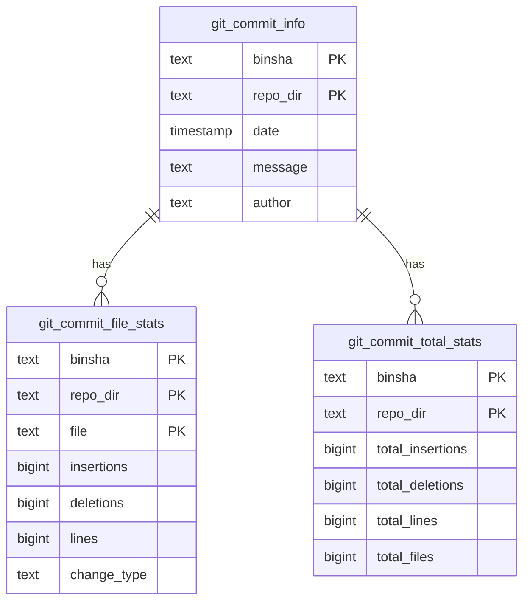

# Git KPIs
Extract commit data from local git repositories.

# DLTHub
This repo provides a [dlthub](https://github.com/dlt-hub/dlt) pipeline to extract git commit data.<br><br>

Running `script.py` with a list of your local repositories as the first argument:
```sh
-- ingest the git commit history for apache iceberg
mkdir tmp
cd tmp
git clone git@github.com:apache/iceberg.git
git clone git@github.com:TomBurdge/git_kpis.git
cd git_kpis
uv run script.py ../iceberg
```

This will load your git commit data into a local duckdb database.<br>
It is straightforward to load your data into a different dlt [destinations](https://dlthub.com/docs/general-usage/destination)

# Entity Relationship Diagram (ERD)
The data will be loaded into the target destination with the follwing format:


# Motivation
Why use this dlt source?<br>
As an engineer, a principal medium for contributing value is delivered throught the medium of committed code. This is usually alongside writing/another form of communication, which could also be committed to a codebase in the form of a README.<br>
Lines of code and number of commits are entirely imperfect substitutes for contribution level nonetheless, employing organizations often use paid services such as [git clear](https://www.gitclear.com/) to quantify employee contributions.<br>
Leaving git analytics solely in the hands of one's employer involves a loss of agency and ownership. Being able to quantify one's own contribution, in a performance review or otherwise, can return agency to the worker.